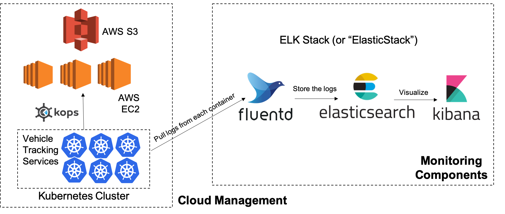
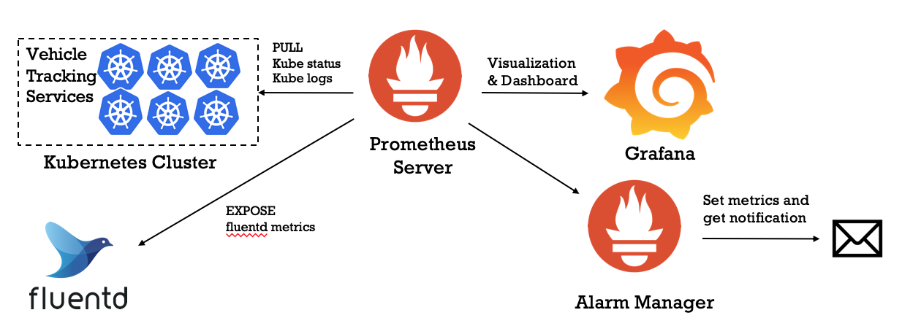

# CloudManager - Using Kubernetes to manage and monitor the developed and containerized microservices on AWS

## Overview
CloudManager is an open source project that provides an intelligent way to help manage and monitor your developed and containerized microservices on AWS using Kubernetes. Kubernetes helps build, deliver and scale the contaierized microservices and monitoring components can help collect and track logs for each container. An example of vehicle tracking application with 6 services is used in this project to demonstrate the workflow. It includes:
* Create K8s pods and services in .yaml files for six microservices that were already containerized in Docker Image
  * Checkout the docker hub: https://hub.docker.com/u/richardchesterwood
* AWS network setups: VPC, internet gateway, network subnets and security groups
* AWS S3, EC2 instances setups
  * S3 is a distributed file system in AWS, where Kops will use to store the working data
* Delpoy k8s cluster on AWS via Kops from the command line
* Build monitoring components by building logging pipline: pull logs from each container by fluentd, store logs in elasticsearch, and visualize by kibana

## Tech Stack
Technologies used: Kubernetes, AWS(S3, EC2), Kops, Fluentd, Elasticsearch, Kibana


## Tool installation and setups
#### Launch AWS EC2 instance and connect EC2 instance in terminal
```
ssh -i <your_pem_key> ec2-user@<ip-address>
```
#### Kops and kubectl installation:  
https://github.com/kubernetes/kops/blob/master/docs/aws.md
- Setup AWS IAM user for Kops, which will require the following IAM permissions:
   ```
   AmazonEC2FullAccess
   AmazonRoute53FullAccess
   AmazonS3FullAccess
   IAMFullAccess
   AmazonVPCFullAccess
   ```
- configure the aws client to use your IAM user
   ```
   aws configure           # Use your new access and secret key here
   aws iam list-users      # you should see a list of all your IAM users here
   ```
#### Create cluster in AWS S3 bucket
- Setup an AWS S3 bucket (distributed file system) for kops to store working data
- Configure the cluster
  ```
  export NAME=<name>.k8s.local
  export KOPS_STATE_STORE=s3://<s3 bucket name>
  aws ec2 describe-availability-zones --region <your region>
  kops create cluster --zones <your region> ${NAME}
  ```
- Build the cluster(Warning: this will continue to charge you until you delete the cluster)\
  `kops update cluster ${NAME} --yes`\
  To ensure the cluster is working, using\
  `kops validate cluster`\
  To delete the cluster, using\
  `kops delete cluster --name ${NAME} --yes`\
Now I have EC2 instances and a load balancer. Load balancer can direct traffic to instances. It has a stable DNS name. For this project  `kubectl get all ` is calling the load balancer.

#### Deploy k8s workloads(.yaml) to the cluster
In the k8s_cluster folder, I created .yaml files of kubernetes pods and services for the vehicle tracking system. Please refer to Kubernetes API overviews for instruction: https://kubernetes.io/docs/reference/generated/kubernetes-api/v1.11/#-strong-api-overview-strong- \
Run all pods and services: `kubectl apply -f .`\
Show all pods and services: `kubectl get all`

## Monitoring system: building log pipeline via ELK Stack using Fluentd, Elasticsearch, and Kibana
Kubernetes provide this add-on component to keep track of logs inside the containers within the kubernete cluster
- Fluentd: pull logs from each container
- Elasticsearc: store the logs
- Kibana: visualization

Pair the configurations into elastic-stack.yaml and fluentd-config.yaml from
https://github.com/kubernetes/kubernetes/tree/master/cluster/addons/fluentd-elasticsearch

## Additional work
Considering that the previous work involved a lot of environmental setups and configuaration, Terraform is a great Infrastructure-as-Code software tool to provision infrastructure. I used Terraform to setup my AWS environment, which can be re-used by me or anyone else in the future. Here are the reference to setup aws modules using Terraform: https://github.com/terraform-aws-modules

## Future work
For this project, kibana dashboard is built for monitoring the whole system. Considering adding notification for serious problem or repeatedly problem, alerting system will be implemented by using Prothemeus so that a more well-established monitoring system will be built for the application. The tech stack for future work is described below.



